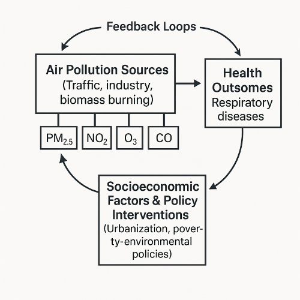

# Global Urban Pollution Profiles & Their Respiratory, Cardiovascular Health Impacts

## 1. Air Pollution as a Global Health Crisis

Air pollution has emerged as one of the most severe global public health threats
of our time. According to the World Health Organization (WHO) and the Global
Burden of Disease (GBD 2024) study, exposure to ambient air pollution is
responsible for an estimated 7 million premature deaths per year—a figure that
continues to rise as industrialization, energy consumption, and urban growth
accelerate across the Global South. These deaths are primarily attributed to
cardiovascular diseases (CVD), respiratory illnesses, stroke, lung cancer, and
other noncommunicable diseases (WHO, 2023; GBD, 2024).

## 2. Major Pollutants and Their Health Pathways

Air pollution is not a homogeneous phenomenon; it consists of multiple pollutants,
each with distinct physical properties, chemical behaviors, and toxicological
impacts on the human body.

**Key pollutants include:**

- **Particulate Matter (PM2.5)**: Fine particles with a diameter less than 2.5
micrometers that penetrate deep into the alveoli. Chronic exposure increases the
risk of heart attacks, stroke, lung cancer, and premature mortality
(Pope & Dockery, 2006; WHO, 2021).

- **Nitrogen Dioxide (NO₂)**: Emitted primarily from vehicle exhaust and
industrial activity, it is a known trigger for childhood asthma, especially in
urban environments (HEI, 2020).

- **Ground-level Ozone (O₃)**: Formed through photochemical reactions involving
sunlight and volatile organic compounds, O₃ causes airway inflammation, reduces
lung function, and exacerbates COPD and asthma (EPA, 2022).

- **Carbon Monoxide (CO)**: Produced by incomplete combustion, it limits oxygen
delivery to vital organs and is especially harmful to pregnant women, infants,
and individuals with pre-existing cardiovascular conditions.

| Pollutant | Health Effects                       | High-Risk Groups           |
|-----------|--------------------------------------|----------------------------|
| PM2.5     | CVD, stroke, lung cancer             | Elderly, general population|
| NO₂       | Asthma onset, lung inflammation      | Children, urban residents  |
| O₃        | Lung irritation, lower lung function | Asthmatics, outdoor workers|
| CO        | Oxygen deprivation, neuro damage     | Pregnant women, infants    |

These pollutant-health links are backed by toxicological and epidemiological research
(Brook et al., 2010; GBD, 2024).

## 3. Why Focus on the Dominant Pollutant?

Although many cities experience a mixture of pollutants, global AQI standards—
including those used by the U.S. Environmental Protection Agency (EPA) and the
World Air Quality Index Project (WAQI)—identify the dominant pollutant as the
one with the highest individual sub-index at a given time (EPA, 2024). In other
words, the pollutant that most significantly degrades air quality at that moment
is used to determine the city’s reported AQI value.

Identifying and categorizing the dominant pollutant in each city is therefore
not a trivial task—it reflects:

- The most hazardous exposure pathway for that population at a given time,  
- The main contributor to health risk, and  
- A basis for targeted environmental interventions.

By profiling cities based on their dominant pollutants, we can evaluate exposure
-specific health burdens and identify regional disparities in both pollution and
its effects.

## 4. Regional Signatures and Pollution Sources

Pollution patterns are heavily shaped by geography, economy, and seasonality.
For instance:

- **South Asia (e.g., Delhi, Lahore):** PM2.5 is typically the dominant pollutant,
especially in winter months due to agricultural burning, heating, and traffic.  

- **Western Europe (e.g., Paris, Madrid):** Often sees O₃ spikes during hot summer
days, despite generally lower PM2.5 levels.  

- **Africa (e.g., Lagos, Nairobi):** Urban NO₂ is rising due to diesel traffic
and industrial emissions.

Such regional signatures are crucial for developing locally tailored air quality
policies. A blanket solution—such as blanket traffic bans or seasonal closures—
may not be effective across diverse pollutant contexts.

## 5. The Pollutant Composition Index (PCI)

In our framework, we introduce the Pollutant Composition Index (PCI) to measure
the distribution of pollution across multiple pollutants:

- A **low PCI** score indicates a pollution profile dominated by a single
pollutant (e.g., PM2.5 accounting for 90% of AQI).  
- A **high PCI** score suggests a balanced mix of pollutants, requiring multi-
faceted control strategies.

This distinction is not only relevant for source attribution (e.g., traffic,
biomass burning, industry) but also for designing policies—a city with a single
dominant pollutant can implement focused interventions, while a mixed-profile
city requires broader reforms.

## 6. Beyond Exposure: Integrating Health Burden Data

Knowing pollutant levels is only the first step. To understand real-world
consequences, we link these environmental profiles to health burden data from
the Global Burden of Disease (GBD) and WHO databases. These datasets offer
metrics like:

- **Years of Life Lost (YLL)**  
- **Disability-Adjusted Life Years (DALYs)**  
- **Cause-specific mortality rates**  

By merging these health metrics with pollutant profiles, we can assess which
pollutant types are most strongly associated with respiratory and cardiovascular
burden across different cities and regions.

### Example Comparative Analysis

- **Delhi, India:**  PM2.5-dominant with annual average levels over 90 µg/m³.
High DALYs from ischemic heart disease and chronic respiratory conditions
(GBD, 2024).  

- **Paris, France:** O₃-dominant during summer months. Moderate AQI but
increased seasonal hospital admissions due to bronchitis and asthma
(WHO, 2023).  

- **Lagos, Nigeria:** Rising NO₂ levels linked with urban traffic and fuel
combustion. Higher asthma incidence in children and workforce absenteeism.

### Example Datasets and Maps

- **OpenAQ:** Real-time air quality data across 100+ countries.  
- **WAQI:** World Air Quality Index maps with historical AQI breakdowns.  
- **GBD Compare Tool:** Health burden visualization by disease and risk
factor.  
- **NASA MODIS & Sentinel-5P:** Satellite-based pollutant concentration maps
for PM2.5, NO₂, and O₃.  

## 7. Analytical Value and Research Gap

While several studies examine pollution levels or health outcomes independently,
few efforts integrate:

- Dominant pollutant classification,  
- Regional pollution patterns,  
- Pollutant-specific health effects,  
- City-by-city variations in respiratory and cardiovascular health outcomes.  

This study addresses this gap through a comparative global analysis that
classifies urban air pollution by dominant pollutant and assesses corresponding
health outcomes.

*Figure 1. Link between pollution sources and health, shaped by policy and context.*

Such a layered approach enables:

- Policy targeting based on the most harmful pollutants,  
- Health system preparedness in high-burden zones,  
- Insights into pollution-health causal pathways for further academic research.

## References

Brook, R. D., et al. (2010). *Circulation, 121*(21), 2331–2378.

EPA. (2022). [Ground-level ozone basics][epa2022].

EPA. (2024). [AQI basics](https://www.airnow.gov/aqi/aqi-basics/).

GBD. (2024). [Global Burden of Disease Study](https://www.healthdata.org/gbd).

HEI. (2020). *Traffic-related air pollution report*.

Pope, C. A., & Dockery, D. W. (2006). *JAWMA, 56*(6), 709–742.

WHO. (2021). *Global Air Quality Guidelines*.

WHO. (2023). [Ambient air pollution][who2023].

[who2023]: https://www.who.int/news-room/fact-sheets/detail/ambient-(outdoor)-air-quality-and-health

[epa2022]: https://www.epa.gov/ground-level-ozone-basics
