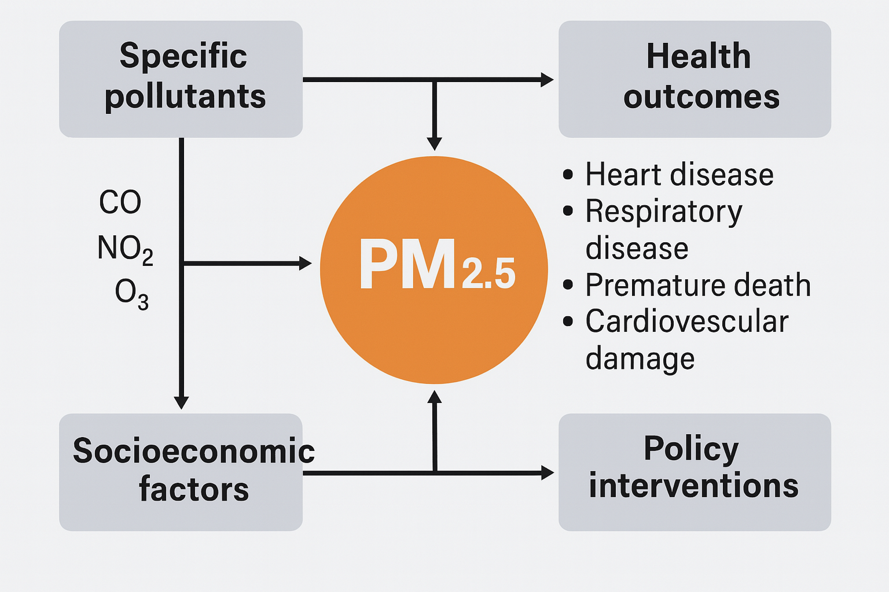

# Long-Term PM2.5 Exposure and Global Health Impacts: A Cross-National Perspective

## 1. Air Pollution as a Global Health Crisis

Air pollution has emerged as one of the most severe global public health threats
of our time. According to the World Health Organization (WHO) and the Global
Burden of Disease (GBD 2024) study, exposure to ambient air pollution is
responsible for an estimated 7 million premature deaths per year—a figure that
continues to rise as industrialization, energy consumption, and urban growth
accelerate across the Global South. These deaths are primarily attributed to
cardiovascular diseases (CVD), respiratory illnesses, stroke, lung cancer, and
other noncommunicable diseases (WHO, 2023; GBD, 2024).

## 2. Major Pollutants and Their Health Pathways

Air pollution is not a homogeneous phenomenon; it consists of multiple pollutants,
each with distinct physical properties, chemical behaviors, and toxicological
impacts on the human body.

**Key pollutants include:**

- **Particulate Matter (PM2.5)**: Fine particles with a diameter less than 2.5
micrometers that penetrate deep into the alveoli. Chronic exposure increases the
risk of heart attacks, stroke, lung cancer, and premature mortality
(Pope & Dockery, 2006; WHO, 2021).

- **Nitrogen Dioxide (NO₂)**: Emitted primarily from vehicle exhaust and
industrial activity, it is a known trigger for childhood asthma, especially in
urban environments (HEI, 2020).

- **Ground-level Ozone (O₃)**: Formed through photochemical reactions involving
sunlight and volatile organic compounds, O₃ causes airway inflammation, reduces
lung function, and exacerbates COPD and asthma (EPA, 2022).

- **Carbon Monoxide (CO)**: Produced by incomplete combustion, it limits oxygen
delivery to vital organs and is especially harmful to pregnant women, infants,
and individuals with pre-existing cardiovascular conditions.

| Pollutant | Health Effects                       | High-Risk Groups           |
|-----------|--------------------------------------|----------------------------|
| PM2.5     | CVD, stroke, lung cancer             | Elderly, general population|
| NO₂       | Asthma onset, lung inflammation      | Children, urban residents  |
| O₃        | Lung irritation, lower lung function | Asthmatics, outdoor workers|
| CO        | Oxygen deprivation, neuro damage     | Pregnant women, infants    |

These pollutant-health links are backed by toxicological and epidemiological research
(Brook et al., 2010; GBD, 2024).

## 3. The Critical Importance of PM2.5 in Air Pollution and Health Research

Fine particulate matter (PM2.5) is now widely regarded as the most harmful air
pollutant to human health due to its physical properties and chemical
composition. Defined as particles with an aerodynamic diameter less than
2.5 micrometers, PM2.5 can penetrate deep into the respiratory tract, reach the
alveolar regions, and even cross into the bloodstream (Dockery, 2009). These
characteristics allow PM2.5 to trigger oxidative stress, systemic inflammation,
and a wide range of cardiovascular and respiratory diseases.

_**Figure 1.** Pathways linking PM2.5 to toxic pollutants and health outcomes,
moderated by socioeconomic and policy factors._

The World Health Organization has highlighted that “the effects of long-term PM
exposure on mortality (life expectancy) seem to be attributable to PM2.5 rather
than to coarser particles” (WHO, 2006). Furthermore, PM2.5 particles often
carry toxic components such as heavy metals, black carbon, and polycyclic
aromatic hydrocarbons, enhancing their biological reactivity and danger to human
health (WHO, 2013).
Epidemiological studies, including the landmark Harvard Six Cities Study, have
provided robust evidence of PM2.5’s association with premature death and
hospital admissions. WHO data suggest that anthropogenic PM2.5 causes
approximately 348,000 premature deaths per year in Europe and reduces life
expectancy by an average of 8.6 months (WHO, 2006).
PM2.5 has become the most commonly used air pollution indicator in
epidemiological studies due to its stronger correlation with health outcomes
compared to other pollutants. Its small size allows it to reach the deepest
areas of the lung and even affect other organs, making it particularly hazardous
in both urban and industrial environments (Kalender & Alkan, 2018).
Supporting this concern, experimental studies have shown that even when
ultra-low sulfur diesel is used, significant PM2.5 emissions can still occur.
Such findings highlight the necessity of stricter emission controls,
particularly in marine and transportation sectors where regulatory oversight may
be limited (Kalender & Ergin, 2017).

## 4. Example Datasets and Satellite Maps

To support global, cross-country comparisons of air pollution and health
impacts, a range of open-access, high-resolution datasets are available:

- **OpenAQ:** Real-time air quality data across 100+ countries

- **WAQI:** Historical AQI trends and dominant pollutant profiles

- **NASA MODIS & Sentinel-5P:** Satellite-derived PM2.5, NO₂, and O₃
concentration maps

- **GBD Compare Tool:** Visualizations of health burdens by disease and risk
factor across countries

- **IHME Socio-Demographic Index (SDI):** Proxy for healthcare access,
education, and economic development

## 5. PM2.5 and Long-Term Health Outcomes

Numerous cohort studies have documented the lagged effects of long-term PM2.5
exposure. The Harvard Six Cities Study (Dockery et al., 1993) and subsequent
multicountry analyses (Liu et al., 2019; Burnett et al., 2018) found strong
associations between cumulative exposure to PM2.5 and increased risks of
ischemic heart disease, chronic obstructive pulmonary disease (COPD), stroke,
and premature mortality. These effects often manifest years after exposure,
highlighting the need for longitudinal, multi-decade analyses to detect true
population-level impacts.
Furthermore, long-term PM2.5 exposure has been linked to systemic inflammation,
atherosclerosis, and vascular dysfunction, which may explain its
disproportionate burden on cardiovascular systems (Rajagopalan et al., 2018).
These findings support the inclusion of both respiratory and cardiovascular
outcomes in integrated environmental health studies.

## 6. Cross-Country Comparison and the Socio-Demographic Index (SDI)

Pollution-related health outcomes do not occur in isolation—they are moderated
by social and demographic factors such as access to healthcare, income,
education, and public health policy. The Socio-Demographic Index (SDI),
developed by IHME, provides a useful framework for controlling for these
variables. Studies have shown that the health burden of pollution tends to be
higher in low- and middle-income countries, even at similar pollution levels,
due to weaker health infrastructure and delayed diagnosis (GBD, 2024; Lim et al.
, 2012).
A global, country-level comparison allows researchers to detect differential
vulnerability across diverse regions, using consistent metrics such as
Disability-Adjusted Life Years (DALYs) and age-standardized death rates
(Balakrishnan et al., 2019).

## 7. COVID-19 and Air Pollution: An Emerging Layer

The COVID-19 pandemic introduced a new dimension to environmental health
research. Multiple studies have explored whether chronic air pollution exposure
contributed to higher COVID-19 mortality, especially in individuals with
pre-existing cardiovascular or respiratory conditions. For instance, Wu et al.
(2020) found that a 1 μg/m³ increase in long-term PM2.5 was associated with an
8% increase in COVID-19 mortality rates across U.S. counties. Similar findings
were observed in Italy, China, and Brazil (Conticini et al., 2020; Cole et al., 2020).
These correlations suggest that air pollution may have primed populations for
worse outcomes during respiratory pandemics, reinforcing the importance of
incorporating infectious disease vulnerability into air pollution analyses.

## 8. Research Gap and Contribution

While there is a substantial body of literature on PM2.5 and health outcomes,
most studies are either national in scope or focus on short-term exposure
effects. Very few combine:

- Long-term PM2.5 trends across multiple countries

- Global burden of respiratory and cardiovascular disease outcomes

- SDI-based stratification to explore inequality in health impact

- COVID-19 mortality as a modifier or outcome

By synthesizing these elements, our study aims to fill a critical gap in the
literature. The use of publicly available, globally harmonized datasets
(e.g., GBD, WHO,) enhances transparency and replicability, while
allowing robust, cross-regional comparisons.

## References

Balakrishnan, K., et al. (2019). The impact of air pollution on deaths, disease
burden, and life expectancy across the globe. _New England Journal of Medicine_,
381(8), 705–714.

Brook, R. D., Rajagopalan, S., et al. (2010). Particulate matter air pollution
andmcardiovascular disease: An update. _Circulation_, 121(21), 2331–2378.

Burnett, R., et al. (2018). Global estimates of mortality associated with
long-term exposure to outdoor fine particulate matter. _PNAS_, 115(38), 9592–9597.

Cole, M., Ozgen, C., & Strobl, E. (2020). Air pollution exposure and COVID-19.
_IZA Discussion Paper Series_.

Conticini, E., Frediani, B., & Caro, D. (2020). Can atmospheric pollution be
considered a co-factor in extremely high COVID-19 lethality in Northern Italy?
_Environmental Pollution_, 261.

Dockery, D. W., et al. (1993). An association between air pollution and mortality
in six U.S. cities. _New England Journal of Medicine_, 329(24), 1753–1759.

Dockery, D. W. (2009). Health Effects of Particulate Air Pollution. _Annals of
Epidemiology_, 19(4), 257–263.

GBD. (2024). Global Burden of Disease Study Results. _Institute for Health Metrics
and Evaluation_. [Global Burden of Disease Study Results](https://www.healthdata.org/gbd)

HEI. (2020). Traffic-related air pollution: A critical review of the literature on
emissions, exposure, and health effects. _Health Effects Institute_.

Kalender, S. S., & Alkan, G. B. (2018). Air Pollution. In: Hussain, C. M. (ed.),
_Handbook of Environmental Materials Management_. Springer, Cham.
[DOI: 10.1007/978-3-319-58538-3_77-1](https://doi.org/10.1007/978-3-319-58538-3_77-1)

Kalender, S. S., & Ergin, S. (2017). An experimental investigation into the
particulate emissions of a ferry fuelled with ultra-low sulfur diesel. _Journal of
Marine Science and Technology_, 25(5), 499–507.
[https://doi.org/10.6119/JMST-017-0418-2](https://doi.org/10.6119/JMST-017-0418-2)

Lim, S. S., et al. (2012). A comparative risk assessment of burden of disease from
67 risk factors. _The Lancet_, 380(9859), 2224–2260.

Liu, C., et al. (2019). Ambient particulate air pollution and daily mortality in
652 cities. _New England Journal of Medicine_, 381, 705–715.

Pope, C. A., & Dockery, D. W. (2006). Health effects of fine particulate air
pollution. _Journal of the Air & Waste Management Association_, 56(6), 709–742.

Rajagopalan, S., Al-Kindi, S., & Brook, R. D. (2018). Air pollution and
cardiovascular disease. _JACC_, 72(17), 2054–2070.
[Global Burden of Disease Study](https://www.healthdata.org/gbd)

WHO. (2006). _Health Risks of Particulate Matter from Long-range Transboundary Air
Pollution_. WHO Regional Office for Europe.

WHO. (2013). _Health Effects of Particulate Matter: Policy Implications for
Countries in Eastern Europe, Caucasus and Central Asia_. WHO Regional Office for
Europe.

WHO. (2021). _WHO Global Air Quality Guidelines: Particulate Matter (PM2.5 and
PM10), Ozone, Nitrogen Dioxide, Sulfur Dioxide and Carbon Monoxide_.

WHO. (2023). _Ambient Air Pollution: A Global Assessment_.
[World Health Organization Data on Air Pollution](https://www.who.int/data/gho/data/themes/air-pollution)

Wu, X., et al. (2020). Exposure to air pollution and COVID-19 mortality in the
United States. _Science Advances_, 6(45), eabd4049.
