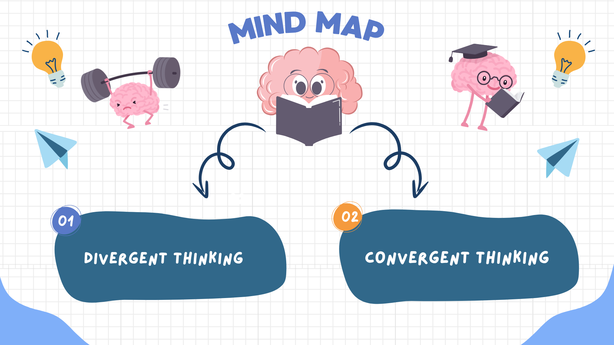

# 

> This folder shows how we went from picking a broad area to settling
on a specific research question.

## [Divergent Thinking](0_domain_study/brainstorming/divergent_thinking)

We all came from different backgrounds, so finding a
topic everyone liked wasn’t easy. We threw around lots of ideas and explored different
domains to see what interested each of us.

## [Convergent Thinking](0_domain_study/brainstorming/convergent_thinking.md)

We made a poll on Slack to vote on which domain the majority preferred.
After that, we searched for different possible research questions
within that domain to find the best fit for our project.
