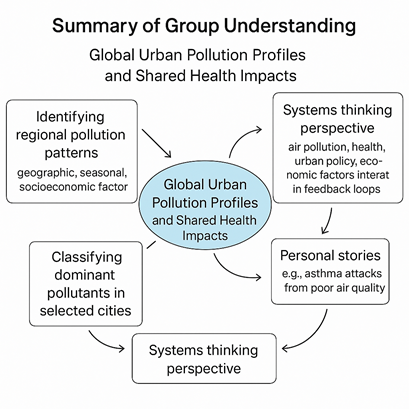

# Summary of Group's Understanding of the Problem Domain

Our project focuses on the link between **long-term air pollution—especially PM2.5—**
and **public health outcomes**, particularly respiratory and cardiovascular diseases.
We approach this issue through a **systems thinking lens**, recognizing that air
pollution is not just a byproduct of emissions, but part of a **dynamic,
interconnected system** involving **policy choices, socioeconomic conditions,
atmospheric processes,** and **health outcomes**.
For example, changes in environmental policies can reduce emissions, improving air
quality and ultimately lowering disease burdens. Understanding these complex
feedback loops helps us see both direct and indirect effects on public health.

Each country’s exposure to PM2.5 is assessed over a long period, capturing trends
rather than snapshots. This approach allows us to explore the **lag effect** — how
long-term pollution exposure can lead to health problems years later.

Our goals include:

- **Analyzing PM2.5 pollution trends across 25 diverse countries**  
- **Examining associations between PM2.5 exposure and respiratory/cardiovascular**
- **disease burdens**  
- **Considering how socio-demographic factors (like SDI) influence these**
**relationships**  
- **Exploring whether long-term PM2.5 exposure may have contributed to COVID-19**
**mortality patterns**

By linking environmental and health data across countries, we aim to produce clear
insights that can guide **targeted, evidence-based public health policies**.
Ultimately, clean air is a critical part of protecting human health worldwide,
not just an environmental concern.
