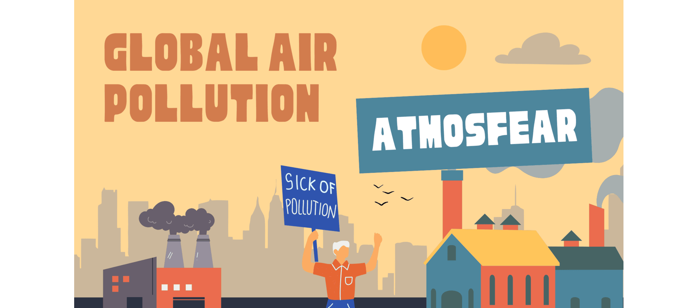

<!-- markdownlint-disable MD013 -->

# 

[![Typing SVG][badge-1]](https://git.io/typing-svg)  
**Atmosfear** is a data science group project that explores the global
challenge of air pollution and its impact on public health. Our goal is to
uncover patterns in how different pollutants dominate across world cities and
how these patterns relate to regional trends in respiratory and cardiovascular
illnesses. By identifying these pollutant profiles and their health
correlations, we aim to fill a critical research gap and hopefully support
more targeted, pollutant-specific policy interventions.

---

[![Typing SVG][badge-2]](https://git.io/typing-svg)  
Air pollution is one of the most underestimated killers in the world today.
Unlike more visible threats, polluted air is invisible and easy to ignore
until it becomes personal. You can't see it, but it's there: silently entering
lungs, aggravating asthma, triggering heart conditions, and cutting lives
short.

According to the WHO (2023) and GBD (2024), air pollution contributes to an
estimated **7 million premature deaths each year** due to its strong links
with cardiovascular and respiratory diseases, stroke, and lung cancer. It's
not just an environmental crisis; it's a public health emergency hiding in
plain sight.

---

[![Typing SVG][badge-3]](https://git.io/typing-svg)  
One of our group members shared a personal story: her mother, who has asthma,
experiences severe discomfort when staying in cities where it is polluted.
Even short visits can mean weeks of relying on medications, constant coughing,
and the simple wish to breathe without pain. For her and millions with
similar and different health conditions, clean air isn’t just a preference,
it’s a necessity.
**But is it feasible to find cities where the air is truly safe for
vulnerable individuals?**  

*Located in the `0_domain_study` folder — [`problem_statement.md`](0_domain_study/problem_statement.md)*

---

[![Typing SVG][badge-4]](https://git.io/typing-svg)  
A brief overview of our shared insights on global air pollution, its health
impacts, and why a deeper pollutant-specific analysis is needed.

*Located in the `0_domain_study` folder — [`sum_of_group_understanding.md`](0_domain_study/sum_of_group_understanding.md)*

---

[![Typing SVG][badge-5]](https://git.io/typing-svg)  
A focused review of key pollutants, global exposure trends, and the
limitations of current metrics like the AQI.

*Located in the `0_domain_study` folder — [`background_review.md`](0_domain_study/background_review.md)*

---

[![Typing SVG][badge-6]](https://git.io/typing-svg)  
>**To what extent have ambient PM₂.₅ concentrations (2010–2019) influenced the burden of cardiovascular and respiratory diseases across countries with varying socio-demographic development levels, and how might this long-term exposure relate to COVID-19 mortality outcomes**

 This question stems from our shared concern about the growing impact of air pollution on public health worldwide. It holds personal significance for us, as we’ve witnessed firsthand how polluted environments affect the well-being of our own communities. Our research is grounded in the broader context of global health inequities and shaped by the practical limitations of a defined research timeframe and the scope of publicly available data  

*Located in the `0_domain_study` folder — [`research_question.md`](0_domain_study/research_question.md)*

---

[![Typing SVG][badge-8]](https://git.io/typing-svg)  
In this project, we study how **long-term exposure to PM2.5** affects
**human health** across **25 countries**. We use **country-level PM2.5 data**
and **disease burden estimates** for **respiratory and cardiovascular outcomes**
from the **Global Burden of Disease (GBD) study**.

We examine **trends in PM2.5 (2010–2019)** and their links to conditions like
**asthma, heart disease, and stroke**. Our analysis also considers the
**lag effect**—how past pollution levels may lead to health problems years later.

Additionally, we explore whether **long-term PM2.5 exposure** is related to
**higher COVID-19 mortality**, possibly due to pre-existing lung or heart damage.
We include the **Socio-demographic Index (SDI)** to assess how
**development level and healthcare access** influence these relationships.

By analyzing **pollution–health patterns** across diverse regions, we aim to produce
**clear, actionable insights** for public health.  

**Clean air is not just about the environment—it’s about protecting people’s lives.**

---

---

[![Typing SVG][badge-9]](https://git.io/typing-svg)  
We used country-level data, which means we may miss important local differences, like how air pollution affects some cities more than others. The study looks at PM₂.₅ and its link to health problems, but we don’t prove it causes them—we only show patterns. We included 25 countries with good data, but that means the results may not apply to all places. Also, some countries report health data differently, which can affect how accurate the comparisons are. Finally, we mention COVID-19 deaths for context, but we don’t say pollution caused them.

---

## Non Technical Explanation of Data Analysis

Our study shows that **long-term exposure to fine air pollution particles (PM₂.₅) from 2010 to 2019** has had a clear impact on public health—especially **heart and lung diseases**. Countries with ****higher pollution levels** generally had **worse health outcomes**, and this effect was **stronger in less developed nations**.

Pollution’s impact wasn’t random. It followed consistent patterns across models, with the **strongest effects** seen in **cardiovascular disease**. Countries like Egypt and Afghanistan faced both high pollution and high health burdens, revealing global health inequalities.

We also found that long-term pollution was **modestly but significantly associated with higher COVID-19 death rates in 2020**. This suggests that air pollution may increase vulnerability during pandemics, especially in countries with **weaker health systems**.

Encouragingly, pollution and disease rates have **declined** over time, showing real progress. Still, long-term pollution leaves lasting effects, especially in vulnerable populations.

**Cleaner air saves lives, and direct pollution reduction is vital where people are most at risk.**

---

[![Typing SVG][badge-10]](https://git.io/typing-svg)  
The [`1_datasets`](1_datasets) folder includes all datasets used throughout the project, including:

- **Raw data**: Unmodified source files  
- **Cleaned data**: Preprocessed and formatted datasets  
- **Final dataset**: Merged and analysis-ready data

*Each dataset is documented in [`/1_datasets/README.md`](1_datasets/README.md), including variable descriptions and data sources.*

---

[![Typing SVG][badge-11]](https://git.io/typing-svg)  
The [`2_data_preparation`](2_data_preparation/) folder contains all scripts and notebooks used to:

- Clean and filter raw datasets  
- Standardize formats and naming  
- Merge datasets for analysis

> To reproduce results, run each script or notebook sequentially.

---

[![Typing SVG][badge-12]](https://git.io/typing-svg)  
The [`3_data_exploration`](3_data_exploration/) folder includes notebooks used for:

- Exploring PM₂.₅ trends and health burdens  
- Visualizing key relationships and patterns  
- Saving figures to the [`figures`](3_data_exploration/figures_1) folder

---

## Collaboration Framework

- [Our Norms](https://github.com/MIT-Emerging-Talent/ET6-CDSP-group-09-repo/blob/main/collaboration/README.md)
- [Our Communication](https://github.com/MIT-Emerging-Talent/ET6-CDSP-group-09-repo/blob/main/collaboration/communication.md)
- [Our Constraints](https://github.com/MIT-Emerging-Talent/ET6-CDSP-group-09-repo/blob/main/collaboration/constraints.md)
- [Our Learning-goals](https://github.com/MIT-Emerging-Talent/ET6-CDSP-group-09-repo/blob/main/collaboration/learning_goals.md)
- [Our Retrospectives](https://github.com/MIT-Emerging-Talent/ET6-CDSP-group-09-repo/tree/main/collaboration/retrospectives)

---

[![Typing SVG][badge-7]](https://git.io/typing-svg)

<table>
  <tr>
    <td align="center">
       
      <a href="https://github.com/FalaqMajeed">Falaq Youniss</a>
    </td>
    <td align="center">
       
      <a href="https://github.com/Husayn01">Hussaini Ahmed</a>
    </td>
    <td align="center">
       
      <a href="https://github.com/linahKhayri">Linah Khayri</a>
    </td>
    <td align="center">
       
      <a href="https://github.com/ObayCipher">Obay Salih</a>
    </td>
    <td align="center">
       
      <a href="https://github.com/Adamx090">Salih Adam</a>
    </td>
    <td align="center">
       
      <a href="https://github.com/salihakalender">Saliha Kalender</a>
    </td>
  </tr>

  <tr>
    <td align="center">
       
      <a href="https://github.com/Mohamedmxz">Mohamed Tilal</a>
    </td>
    <td align="center">
       
      <a href="https://github.com/SiSaR-Pal">Said Ibrahim</a>
    </td>
    <td align="center">
       
      <a href="https://github.com/MPKenley">Mervil Pierre</a>
    </td>
    <td align="center">
       
      <a href="https://github.com/Ridwanayinde">Ridwan Ayinde</a>
    </td>
    <td align="center">
       
      <a href="https://github.com/Mithchell509">Mithchell Lawensky</a>
    </td>
    <td align="center">
       
      <a href="https://github.com/Safiya-hash">Safiya Hashimi</a>
    </td>
  </tr>
</table>

<!-- Badge URLs below -->

[badge-1]: https://readme-typing-svg.herokuapp.com?font=Fira+Code&weight=600&pause=1000&color=B6871ED2&width=435&lines=What+Is+Atmosfear%3F
[badge-2]: https://readme-typing-svg.herokuapp.com?font=Fira+Code&weight=600&pause=1000&color=B6871ED2&width=435&lines=Why+Air+Pollution
[badge-3]: https://readme-typing-svg.herokuapp.com?font=Fira+Code&weight=600&pause=1000&color=B6871ED2&width=435&lines=Problem+Statment
[badge-4]: https://readme-typing-svg.herokuapp.com?font=Fira+Code&weight=600&pause=1000&color=B6871ED2&width=435&lines=Summary+Of+Our+Group+Understanding+
[badge-5]: https://readme-typing-svg.herokuapp.com?font=Fira+Code&weight=600&pause=1000&color=B6871ED2&width=435&lines=Background+Review
[badge-6]: https://readme-typing-svg.herokuapp.com?font=Fira+Code&weight=600&pause=1000&color=B6871ED2&width=435&lines=Research+Question
[badge-7]: https://readme-typing-svg.herokuapp.com?font=Fira+Code&weight=600&pause=1000&color=B6871ED2&width=435&lines=Atmosfear+Team+Members
[badge-8]: https://readme-typing-svg.herokuapp.com?font=Fira+Code&weight=600&pause=1000&color=B6871ED2&width=435&lines=Non-Technical+Explanation+of+domain+Modeling
[badge-9]: https://readme-typing-svg.herokuapp.com?font=Fira+Code&weight=600&pause=1000&color=B6871ED2&width=435&lines=Limitations+of+Our+Model+Approach
[badge-10]: https://readme-typing-svg.herokuapp.com?font=Fira+Code&weight=600&pause=1000&color=B6871ED2&width=435&lines=Data+Overview
[badge-11]: https://readme-typing-svg.herokuapp.com?font=Fira+Code&weight=600&pause=1000&color=B6871ED2&width=435&lines=Data+Preparation
[badge-12]:https://readme-typing-svg.herokuapp.com?font=Fira+Code&weight=600&pause=1000&color=B6871ED2&width=435&lines=Data+Exploration
